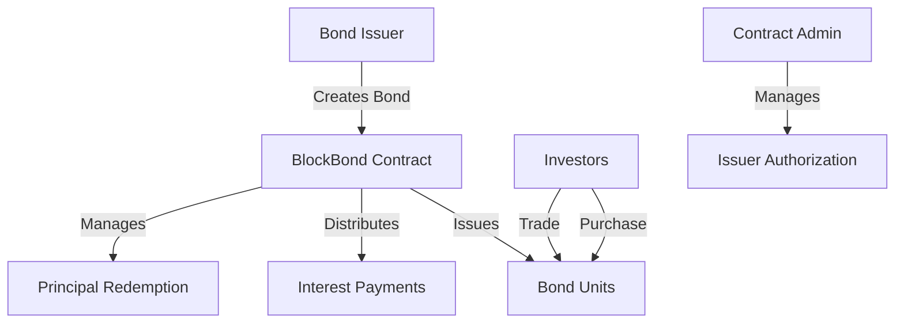

# Elegant Wrap Service

A sophisticated smart contract platform for flexible bond wrapping and trading on the Stacks blockchain. Elegant Wrap Service empowers users to create, trade, and manage digital bond instruments with advanced financial primitives and seamless on-chain interactions.

## Overview

BlockBond revolutionizes traditional bond markets by bringing them onto the blockchain, offering:

- **Automated Bond Lifecycle Management**: From issuance to maturity
- **Customizable Bond Parameters**: Interest rates, payment schedules, denominations
- **Streamlined Trading**: Both primary and secondary market capabilities
- **Automated Payments**: Scheduled interest distributions and principal redemption
- **Transparent Records**: Immutable tracking of ownership and payment history

## Architecture

The platform is built around a central smart contract that manages the entire bond lifecycle. 



### Core Components:
- Bond Issuance Management
- Investor Holdings Registry
- Interest Payment System
- Trading Infrastructure
- Maturity and Redemption Handling

## Contract Documentation

### Core Functions

#### Bond Issuance
- `create-bond`: Creates a new bond with specified parameters
- `add-bond-issuer`: Authorizes an issuer (admin only)
- `remove-bond-issuer`: Removes issuer authorization

#### Investment Operations
- `purchase-bonds`: Buy bonds in primary market
- `transfer`: Trade bonds in secondary market
- `get-balance`: Check bond holdings

#### Financial Operations
- `fund-interest-payments`: Issuer funds interest payments
- `claim-interest`: Bondholders claim interest
- `redeem-bonds`: Redeem mature bonds
- `early-redemption`: Optional early redemption if allowed

### Access Control
- Contract Owner: Can manage issuer authorizations
- Bond Issuers: Can create and manage bonds
- Investors: Can purchase, trade, and redeem bonds

## Getting Started

### Prerequisites
- Clarinet
- Stacks Wallet
- STX tokens for transactions

### Usage Examples

1. Creating a Bond
```clarity
(contract-call? .blockbond create-bond
    u1000000000 ;; total face value
    u1000000    ;; denomination
    u500        ;; 5% interest rate
    u144        ;; payment frequency (blocks)
    u52560      ;; maturity (~ 1 year in blocks)
    false       ;; early redemption not allowed
)
```

2. Purchasing Bonds
```clarity
(contract-call? .blockbond purchase-bonds
    u1          ;; bond ID
    u5          ;; units to purchase
    none        ;; recipient (optional)
)
```

3. Claiming Interest
```clarity
(contract-call? .blockbond claim-interest u1)
```

## Function Reference

### Bond Management
```clarity
(create-bond (total-face-value uint) (denomination uint) (interest-rate uint) 
            (payment-frequency uint) (maturity-blocks uint) (allow-early-redemption bool))
```

### Trading Operations
```clarity
(purchase-bonds (bond-id uint) (units uint) (recipient (optional principal)))
(transfer (bond-id uint) (amount uint) (recipient principal))
```

### Financial Operations
```clarity
(fund-interest-payments (bond-id uint) (amount uint))
(claim-interest (bond-id uint))
(redeem-bonds (bond-id uint))
```

## Development

### Testing
1. Clone the repository
2. Install Clarinet
3. Run tests:
```bash
clarinet test
```

### Local Development
1. Start Clarinet console:
```bash
clarinet console
```
2. Deploy contract:
```clarity
(contract-call? .blockbond ...)
```

## Security Considerations

### Key Safety Measures
- Access control for administrative functions
- Input validation for all operations
- Balance checks before transfers
- Maturity verification for redemptions

### Limitations
- Interest rates are fixed at issuance
- No support for variable rate bonds
- Early redemption must be enabled at creation
- All operations in STX tokens only

### Best Practices
- Always verify bond parameters before purchase
- Monitor interest payment schedules
- Maintain sufficient STX balance for operations
- Review bond terms thoroughly before investing